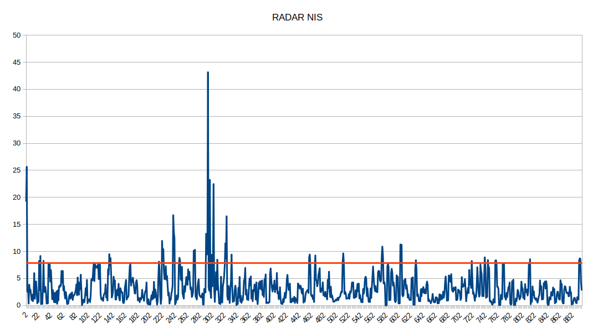
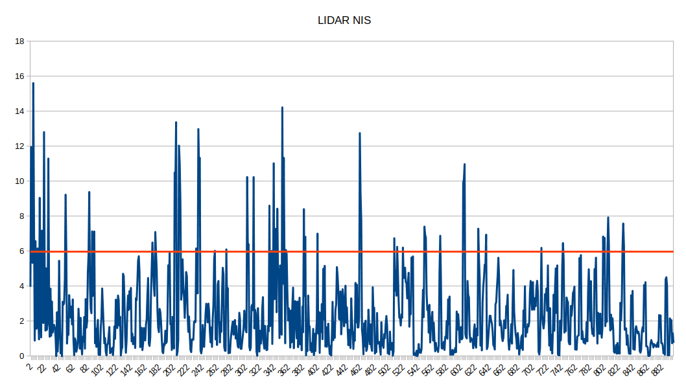

# SFND_Unscented_Kalman_Filter
Sensor Fusion UKF Highway Project

In this project I have implement an Unscented Kalman Filter to estimate the state of multiple cars on a highway using noisy lidar and radar measurements. 

The program can be built and ran by doing the following from the project top directory.

1. mkdir build
2. cd build
3. cmake ..
4. make
5. ./ukf_highway

`main.cpp` is using `highway.h` to create a straight 3 lane highway environment with 3 traffic cars and the main ego car at the center. 
The viewer scene is centered around the ego car and the coordinate system is relative to the ego car as well. The ego car is green while the 
other traffic cars are blue. The traffic cars will be accelerating and altering their steering to change lanes. Each of the traffic car's has
it's own UKF object generated for it, and will update each indidual one during every time step. 

The red spheres above cars represent the (x,y) lidar detection and the purple lines show the radar measurements with the velocity magnitude along the detected angle. The Z axis is not taken into account for tracking, so you are only tracking along the X/Y axis.

---

## Dependencies
* cmake >= 3.5
* make >= 4.1 (Linux, Mac), 3.81 (Windows)
* gcc/g++ >= 5.4
* PCL 1.2

## Build Instructions

1. Clone this repo.
2. Make a build directory: `mkdir build && cd build`
3. Compile: `cmake .. && make`
4. Run it: `./ukf_highway`

## NIS Plots

The next two charts show the Normalised Innovation Square (NIS) for all of the three cars over time, for radar and lidar respectively. The horizontal orange line is the 95 percentile of the relevant chi-square distributions. Most but not all points are under the quantile, sugegsting that the process variance has been reasonably estimated.

  
 
 
 
 ## Credits
 
 The project uses and include the [Eigen](http://eigen.tuxfamily.org/index.php?title=Main_Page) C++ template library for linear algebra.
 
 Code based on the skeleton provided by Udacity as part of the Sensor Funsion Nanodegree Program. 